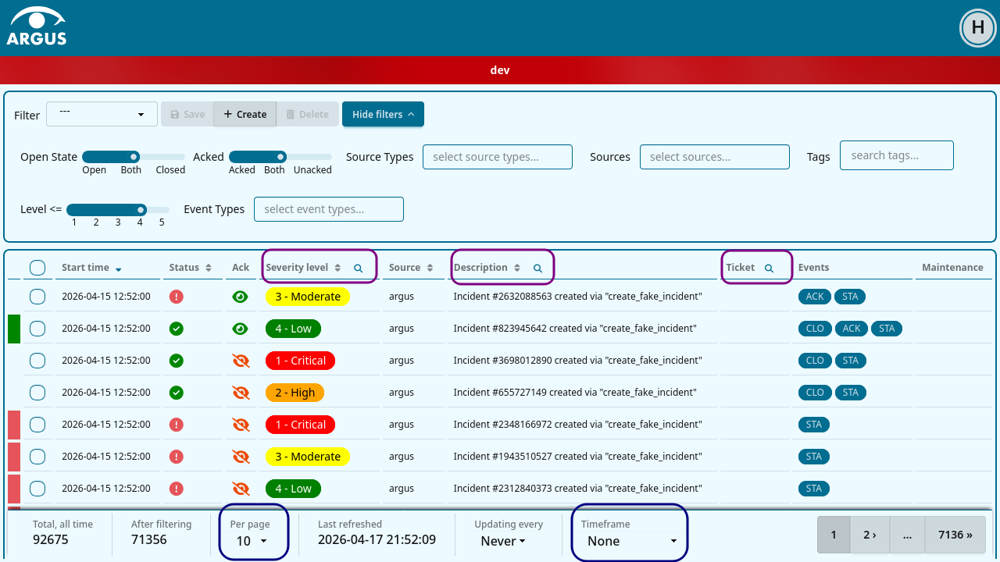
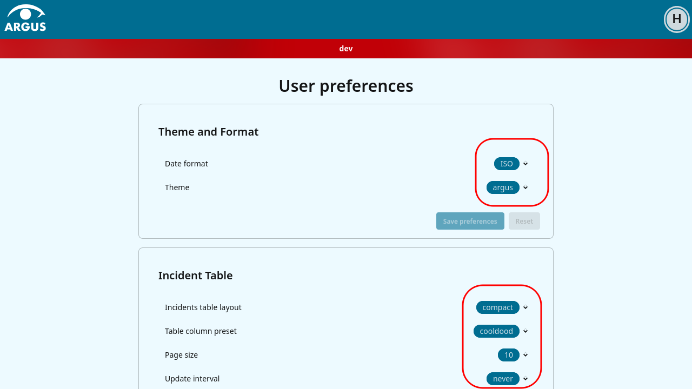

===========================================================
Examples of usage of the single field form pattern in Argus
===========================================================

Usage on the incident dashboard
===============================

The areas outlined in dark blue: "Per page" and "Timeframe" inherits directly
from ``argus.htmx.incident.forms.base.IncidentListForm`` and uses GET in order
to be bookmarkable.

* ``argus.htmx.incident.forms.incident_filters.PageSizeForm``, its selected
  value is stored as a user preference in the database.
* ``argus.htmx.incident.forms.incident_filters.TimeframeForm``, its selected
  value is stored in the session.

The dropdown "Updating every" is not a single field form (yet?), uses POST, and
stores its selected value as a user preference in the database.

Tne areas outlined in purple: "Severity level", "Description" and "Ticket"
mixes in ``argus.htmx.incident.forms.base.SearchMixin`` with
``argus.htmx.incident.forms.base.IncidentListForm``. Not shown is any form
using ``argus.htmx.incident.forms.base.HasTextSearchMixin``. None of these
store the selected value.

* ``argus.htmx.incident.forms.incident_filters.LevelForm``
* ``argus.htmx.incident.forms.incident_filters.DescriptionForm``
* ``argus.htmx.incident.forms.incident_filters.FindTicketForm``

We have plans to turn every field below "Hide filters" into single field forms.

Usage on the preferences page
=============================

All the fields outlined in red: "Date format", "Theme", "Incidents table
layout", "Table column preset", "Page size", and "Update interval", inherits
from ``argus.htmx.user.preferences.forms.SimplePreferenceForm`` and stores
their seleected values as a user preference in the database.

These single field forms does not use a "fieldname" attribute" but instead
makes the fieldname available through a `get_fieldname`` method that fetches
the name of the first (only) field.

There are some additional forms in ``argus.htmx.user.preferences.forms``, these
are for forks that are still on the old system.
